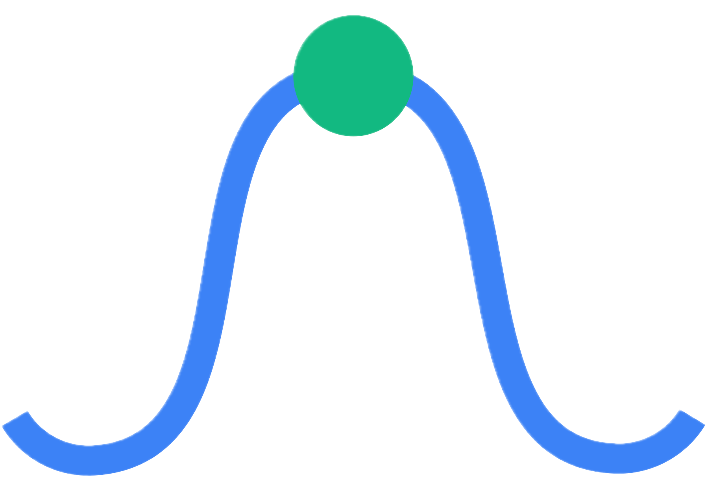

<h1>
  
  PulseDesk
</h1>

O **PulseDesk** é uma aplicação de corretora desenvolvida com arquitetura baseada em microsserviços e eventos.

A plataforma permite consultar dados de mercado, enviar ordens de compra e venda, acompanhar o histórico de ordens e visualizar o portfólio do usuário, com atualizações em tempo real.

## Tecnologias

### Backend

* Java
* Spring Boot
* Apache Kafka
* Apache Avro
* Confluent Schema Registry
* PostgreSQL
* WebSocket / STOMP
* Maven

### Frontend

* Angular
* TypeScript
* PrimeNG
* RxJS

### Infraestrutura

* Docker
* Docker Compose

### Market Data

* Finnhub API

---

## Estrutura do projeto

```text
pulsedesk/
├── backend/
│   ├── market-data-service/
│   ├── trading-service/
│   ├── portfolio-service/
│   └── websocket-gateway/
│
├── frontend/
│   └── pulsedesk-ui/
│
├── contracts/
│   └── events/
│
└── compose.yaml
```

* `backend/`: microsserviços desenvolvidos com Spring Boot.
* `frontend/`: aplicação Angular.
* `contracts/`: contratos Avro utilizados nos eventos Kafka.
* `compose.yaml`: configuração dos containers da aplicação.

---

## Arquitetura

O PulseDesk utiliza uma arquitetura orientada a eventos.

O **Apache Kafka** é responsável pela comunicação assíncrona entre os serviços, enquanto os contratos dos eventos são definidos utilizando **Apache Avro** e registrados no **Schema Registry**.

O frontend também recebe atualizações em tempo real através de **WebSocket utilizando STOMP**.

---

## Como executar

### Pré-requisitos

Para executar o projeto é necessário ter instalado:

* Docker
* Docker Compose

Também é necessária uma chave da **Finnhub API** para que o Market Data Service consiga consultar dados de mercado.

Configure a chave da API de acordo com as variáveis de ambiente definidas para o projeto antes de iniciar os containers.

---

### Iniciar a aplicação

Na raiz do projeto, execute:

```bash
docker compose up --build
```

O Docker Compose irá construir e iniciar os serviços necessários para a aplicação.

---

## Serviços

| Serviço             |  Porta |
| ------------------- | -----: |
| Frontend            | `4200` |
| Market Data Service | `8081` |
| Trading Service     | `8082` |
| Portfolio Service   | `8083` |
| WebSocket Gateway   | `8084` |
| Schema Registry     | `8085` |
| Kafka               | `9092` |
| PostgreSQL          | `5432` |

Após a inicialização, o frontend estará disponível em:

```text
http://localhost:4200
```

---

## Principais endpoints

### Market Data

```http
GET /api/market-data/{symbol}
```

Consulta os dados de mercado de um ativo.

### Orders

```http
POST /api/orders
```

Envia uma nova ordem de compra ou venda.

```http
GET /api/orders/{userId}
```

Consulta o histórico de ordens de um usuário.

### Portfolio

```http
GET /api/portfolio/{userId}
```

Consulta o portfólio atual do usuário.

---

## WebSocket

O frontend se conecta ao WebSocket Gateway através de:

```text
ws://localhost:8084/ws
```

Os principais tópicos utilizados são:

```text
/topic/market-data
/topic/portfolio
/topic/order
```

---

## Encerrar a aplicação

Para parar os containers:

```bash
docker compose down
```

Para acompanhar os containers em execução:

```bash
docker compose ps
```

Para visualizar os logs:

```bash
docker compose logs -f
```

---

## Sobre o projeto

O PulseDesk foi desenvolvido com foco no estudo e aplicação de conceitos de **Engenharia de Software**, incluindo microsserviços, APIs REST, arquitetura orientada a eventos, comunicação assíncrona, contratos de eventos, persistência de dados, containers e comunicação em tempo real.
