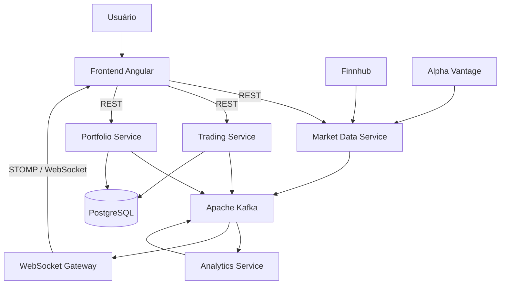

<h1>
  
  PulseDesk
</h1>

O **PulseDesk** é uma workstation de corretora simulada, construída com microsserviços, arquitetura orientada a eventos e atualizações em tempo real.

## Visão geral

O PulseDesk reúne, em uma única interface, consulta de cotações, envio de ordens simuladas, acompanhamento da carteira, histórico de ordens e indicadores de mercado. O backend é dividido em microsserviços Spring Boot que se comunicam por APIs REST e eventos Kafka. O frontend Angular recebe as mudanças relevantes por WebSocket/STOMP, sem depender de recarregamentos manuais.

### Funcionalidades

- Consulta de preço atual e variação percentual de ativos pela Finnhub.
- Consulta de preços históricos diários pela Alpha Vantage.
- Monitoramento periódico dos símbolos presentes nas carteiras.
- Criação de ordens simuladas de compra e venda.
- Validação de horário de mercado, saldo disponível e quantidade em carteira.
- Persistência de ordens, saldo e posições em PostgreSQL.
- Atualização do último preço e do valor de mercado das posições.
- Histórico de ordens criadas, executadas e rejeitadas.
- Reconstrução do valor histórico da carteira com dados de fechamento.
- Cálculo da volatilidade de 20 dias pelo Analytics Service.
- Atualizações em tempo real de mercado, carteira, ordens e analytics.

## Interface

<p align="center">
  
  <br>
  <em>Figura 1: Visão geral da carteira de ações.</em>
</p>

<br>

<p align="center">
  
  <br>
  <em>Figura 2: Histórico de ordens realizadas.</em>
</p>

## Arquitetura



O Kafka mantém os fluxos assíncronos desacoplados. Os eventos são serializados com Apache Avro, e seus schemas são gerenciados pelo Confluent Schema Registry. Chamadas REST são usadas nas consultas síncronas que precisam de resposta imediata, como obter a cotação necessária para validar uma ordem.

### Microsserviços

| Componente | Responsabilidade |
| --- | --- |
| `market-data-service` | Consulta cotações e histórico, monitora ativos da carteira e publica atualizações de mercado. |
| `trading-service` | Recebe ordens, consulta mercado e carteira, aplica validações, persiste o resultado e publica eventos. |
| `portfolio-service` | Mantém saldo e posições, atualiza preços e reconstrói o histórico de valor da carteira. |
| `analytics-service` | Consome fechamentos históricos e calcula a volatilidade percentual de 20 dias (`VOLATILITY_20D`). |
| `websocket-gateway` | Converte eventos Kafka em mensagens STOMP enviadas ao frontend. |
| `pulsedesk-ui` | Disponibiliza dashboard, mercado, carteira, histórico e formulário de ordens. |

### Fluxos principais

#### Dados de mercado e analytics

1. O Market Data Service consulta uma cotação na Finnhub.
2. A cotação é devolvida pela API REST e publicada como `market-data.updated`.
3. O Portfolio Service usa o evento para atualizar o `lastPrice` das posições.
4. O WebSocket Gateway encaminha a cotação para `/topic/market-data`.
5. O histórico diário obtido da Alpha Vantage é publicado como `historical-market-data.updated`.
6. O Analytics Service calcula a volatilidade dos 20 retornos mais recentes e publica `analytics.updated`.
7. O resultado chega ao frontend por `/topic/analytics`.

Os ativos das carteiras são sincronizados na inicialização e periodicamente. As cotações dos símbolos monitorados são atualizadas a cada 10 segundos por padrão.

#### Processamento de ordens

1. O frontend envia uma ordem para o Trading Service.
2. A ordem é persistida com status inicial `CREATED`, e o evento `order.created` é publicado.
3. O serviço verifica o horário do mercado e obtém a cotação e a carteira do usuário.
4. Compras sem saldo e vendas sem posição suficiente são rejeitadas.
5. Uma ordem válida é executada pelo simulador e gera `order.executed`; as demais geram `order.rejected`.
6. O Portfolio Service consome ordens executadas, atualiza saldo e posição e publica `portfolio.updated`.
7. O WebSocket Gateway encaminha as mudanças para `/topic/orders` e `/topic/portfolio`.

## Eventos

Os schemas estão versionados em `contracts/events` e são registrados automaticamente conforme os produtores publicam eventos.

| Tópico Kafka | Produtor | Consumidores principais |
| --- | --- | --- |
| `market-data.updated` | Market Data Service | Portfolio Service e WebSocket Gateway |
| `historical-market-data.updated` | Market Data Service | Analytics Service |
| `analytics.updated` | Analytics Service | WebSocket Gateway |
| `order.created` | Trading Service | WebSocket Gateway |
| `order.executed` | Trading Service | Portfolio Service e WebSocket Gateway |
| `order.rejected` | Trading Service | WebSocket Gateway |
| `portfolio.updated` | Portfolio Service | Market Data Service e WebSocket Gateway |

## Tecnologias

| Camada | Tecnologias |
| --- | --- |
| Backend | Java 21, Spring Boot 4.1, Spring MVC, Spring Data JPA e Maven |
| Frontend | Angular 22, TypeScript, PrimeNG, RxJS e Chart.js |
| Mensageria | Apache Kafka em modo KRaft, Apache Avro e Confluent Schema Registry |
| Dados | PostgreSQL 17, Hibernate e Flyway |
| Tempo real | WebSocket e STOMP |
| Infraestrutura | Docker e Docker Compose |
| Market data | Finnhub API e Alpha Vantage API |

## Estrutura do repositório

```text
pulsedesk/
├── backend/
│   ├── analytics-service/
│   ├── market-data-service/
│   ├── portfolio-service/
│   ├── trading-service/
│   └── websocket-gateway/
├── contracts/
│   └── events/
├── docs/
├── frontend/
│   └── pulsedesk-ui/
├── infrastructure/
│   └── postgres/
├── compose.yaml
└── env.example
```

## Como executar

### Pré-requisitos

- Git
- Docker com Docker Compose
- Chave da Finnhub API
- Chave da Alpha Vantage API

Não é necessário instalar Java, Maven, Node.js, PostgreSQL ou Kafka localmente para executar a aplicação com Docker.

### 1. Clone o repositório

```bash
git clone https://github.com/brualbuquerqxe/pulsedesk.git
cd pulsedesk
```

### 2. Configure as variáveis de ambiente

```bash
cp env.example .env
```

Preencha as duas chaves de market data no arquivo `.env`:

```dotenv
FINNHUB_API_KEY=sua_chave_finnhub
ALPHA_VANTAGE_API_KEY=sua_chave_alpha_vantage
```

As demais variáveis já possuem valores adequados para desenvolvimento local. Não envie o arquivo `.env` ao repositório.

### 3. Inicie a aplicação

```bash
docker compose up --build
```

Quando os containers estiverem prontos, acesse [http://localhost:4200](http://localhost:4200).

O PostgreSQL é inicializado com um usuário e uma carteira de demonstração.

### 4. Acompanhe ou encerre os containers

```bash
# Exibir o estado dos serviços
docker compose ps

# Acompanhar os logs
docker compose logs -f

# Encerrar a aplicação sem apagar os dados
docker compose down
```

## Portas locais

| Componente | Porta | Observação |
| --- | ---: | --- |
| Frontend | `4200` | Interface Angular |
| Market Data Service | `8081` | REST e Actuator |
| Trading Service | `8082` | REST e Actuator |
| Portfolio Service | `8083` | REST e Actuator |
| WebSocket Gateway | `8084` | WebSocket/STOMP e Actuator |
| Schema Registry | `8085` | Porta externa; internamente usa `8081` |
| Kafka | `9092` | Porta externa; entre containers usa `19092` |
| PostgreSQL | `5432` | Schemas `portfolio` e `trading` |

O Analytics Service funciona apenas como consumidor e produtor Kafka e, por isso, não expõe uma porta HTTP.

## API REST

| Método | Endpoint | Descrição |
| --- | --- | --- |
| `GET` | `/api/market-data/{symbol}` | Retorna preço, variação percentual e timestamp do ativo. |
| `GET` | `/api/market-data/{symbol}/history` | Retorna os fechamentos diários disponíveis. |
| `POST` | `/api/orders` | Cria uma ordem simulada e retorna HTTP `202 Accepted`. |
| `GET` | `/api/orders/{userId}` | Retorna o histórico de ordens do usuário. |
| `GET` | `/api/portfolio/{userId}` | Retorna saldo e posições atuais. |
| `GET` | `/api/portfolio/active-symbols` | Retorna os símbolos presentes nas carteiras. |
| `GET` | `/api/portfolio/{userId}/history` | Retorna a evolução diária do valor da carteira. |
| `POST` | `/api/portfolio/{userId}/history/reconstruct` | Solicita a reconstrução do histórico e retorna HTTP `204 No Content`. |

## WebSocket

O frontend abre uma conexão STOMP em:

```text
ws://localhost:8084/ws
```

| Destino | Conteúdo |
| --- | --- |
| `/topic/market-data` | Atualizações de preço e variação percentual. |
| `/topic/portfolio` | Mudanças de saldo, posição e último preço. |
| `/topic/orders` | Transições de status das ordens. |
| `/topic/analytics` | Indicadores calculados pelo Analytics Service. |

## Limitações atuais

- Execução de ordens exclusivamente simulada, sem integração com uma corretora real.
- Ambiente voltado ao desenvolvimento local e sem autenticação de usuários.
- Usuário de demonstração definido por identificador fixo no frontend.
- Disponibilidade e frequência dos dados sujeitas aos limites das APIs Finnhub e Alpha Vantage.
- Tópicos com uma partição e fator de replicação 1, adequados ao ambiente local.

## Objetivo do projeto

O PulseDesk foi desenvolvido para aplicar, de ponta a ponta, conceitos de engenharia de software como microsserviços, comunicação síncrona e assíncrona, contratos de eventos, compatibilidade de schemas, persistência transacional, migrations, containers e entrega de atualizações em tempo real.
